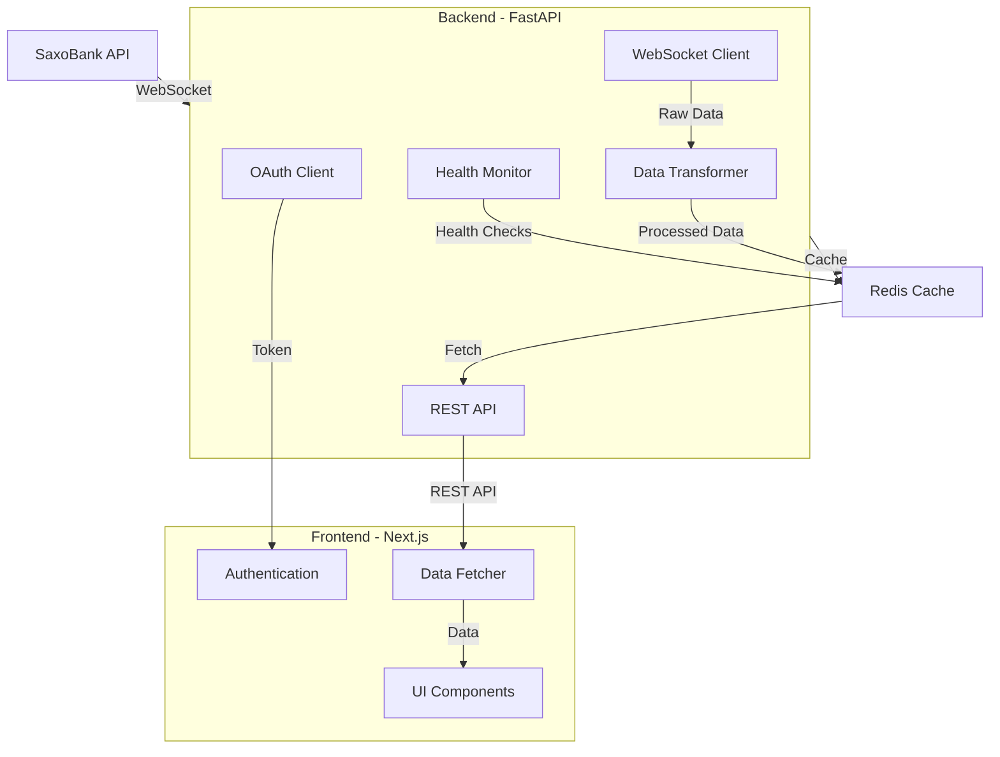

# Data Flow from Backend to Frontend with Redis Caching

The JH Market Data Service uses a modern architecture with FastAPI backend, Redis cache, and Next.js frontend to deliver real-time market data.

## Core Data Flow Architecture

```
SaxoBank API → Backend (FastAPI) → Redis Cache → Frontend (Next.js)
```

## 1. Data Ingestion

The data flow begins with `saxo_ws.py` which handles WebSocket streaming from SaxoBank:

- Connects to SaxoBank WebSockets using OAuth credentials
- Receives real-time market data (primarily FX pairs)
- Processes and transforms the incoming data

## 2. Redis Caching Layer

The market data is stored in Redis with a short TTL (30 seconds) as specified in `market_data.py`:

```python
REDIS_TTL_SECONDS = 30
```

Data is stored using these patterns:
- FX data: `fx:{SYMBOL}` (e.g., `fx:EUR-USD`)
- Market status: `service:market_data:status`
- Heartbeat: `service:market_data:heartbeat`

The `redis_client.py` handles Redis connections using the dependency pattern:

```python
async def get_redis():
    redis = Redis(connection_pool=get_redis_pool())
    try:
        yield redis
    finally:
        await redis.close()
```

## 3. API Layer

The FastAPI backend exposes several endpoints to query this cached data:

- `/api/price` - Get latest price for a symbol
- `/api/ticks` - Get recent tick history
- `/api/health` - Check system health

When the frontend requests data, FastAPI handlers like `fetch_price()` and `fetch_ticks()` in `market_data.py` retrieve data from Redis:

```python
async def fetch_price(
    symbol: str,
    redis: Redis = Depends(get_redis),
    settings = Depends(get_settings),
    logger = Depends(get_logger),
) -> PriceResponse:
    """
    Return the latest mid‐price for a symbol from Redis.
    """
    # ... retrieves from redis using fx:{symbol} key
```

## 4. Frontend Integration

The Next.js frontend connects to these API endpoints using components like `Watchlist.tsx`. The frontend:

- Fetches data on component mount
- Sets up polling intervals (every 3 seconds) for real-time updates
- Updates the UI based on new data

```tsx
// From frontend/src/components/Watchlist.tsx
useEffect(() => {
  const interval = setInterval(async () => {
    const allSymbols = [...FX_MAJORS, ...RATES, ...INDICES];
    const dataPromises = allSymbols.map(generateDataForSymbol);
    const results = await Promise.all(dataPromises);
    
    // Filter out null results and track errors
    const validData: MarketData[] = [];
    const errors: string[] = [];
    
    results.forEach((result, index) => {
      if (result) {
        validData.push(result);
      } else {
        errors.push(allSymbols[index]);
      }
    });
    
    setWatchlistData(prev => 
      validData.map((newItem) => ({
        ...newItem,
        sparklineData: [...(prev.find(p => p.symbol === newItem.symbol)?.sparklineData?.slice(1) || []), newItem.bid],
      }))
    );
    setDataErrors(errors);
    setLastUpdate(new Date());
  }, 3000); // Update every 3 seconds

  return () => clearInterval(interval);
}, []);
```

### Data Fetching Logic

The frontend fetches data from the authenticated API endpoints:

```tsx
// frontend/src/components/Watchlist.tsx
const fetchRealData = async (symbol: string): Promise<MarketData | null> => {
  try {
    const apiBaseUrl = process.env.NEXT_PUBLIC_API_BASE_URL;
    const token = localStorage.getItem('saxo_access_token');
    
    if (!apiBaseUrl || !token) {
      console.warn(`Missing API URL or token for ${symbol}`);
      return null;
    }

    const response = await fetch(`${apiBaseUrl}/market/price/${symbol}`, {
      headers: {
        'Authorization': `Bearer ${token}`,
        'Content-Type': 'application/json'
      }
    });

    if (!response.ok) {
      console.warn(`Failed to fetch real data for ${symbol}`);
      return null;
    }

    const priceData = await response.json();
    
    // Convert backend PriceResponse to MarketData format
    return {
      symbol: priceData.symbol,
      bid: Number((priceData.price - 0.0001).toFixed(5)),
      ask: Number((priceData.price + 0.0001).toFixed(5)),
      timestamp: priceData.timestamp,
      // Additional fields...
    };
  } catch (error) {
    console.error(`Error fetching real data for ${symbol}:`, error);
    return null;
  }
};
```

### WebSocket Connection Status

The `ConnectionStatus.tsx` component provides visual feedback on the connection state:
- Green when connected
- Red when disconnected
- Orange when reconnecting

```tsx
// frontend/src/components/ConnectionStatus.tsx
export default function ConnectionStatus({ status }: ConnectionStatusProps) {
  const getStatusIcon = () => {
    if (status.reconnecting) {
      return <RotateCcw className="h-4 w-4 animate-spin text-orange-500" />;
    }
    
    if (status.connected) {
      return <Wifi className="h-4 w-4 text-bull" />;
    }
    
    return <WifiOff className="h-4 w-4 text-bear" />;
  };

  const getStatusText = () => {
    if (status.reconnecting) return 'Reconnecting...';
    if (status.connected) return 'Connected';
    return 'Disconnected';
  };
  
  // Additional rendering...
}
```

## 5. OAuth Credential Flow & Token Management

The OAuth credential flow securely connects to the SaxoBank API with proper token lifecycle management.

### Initial Authorization

The process begins with obtaining an authorization code:

1. The user is redirected to SaxoBank's OAuth endpoint
2. After authenticating, SaxoBank returns an authorization code
3. The code is exchanged for access and refresh tokens

```python
# backend/services/oauth_client.py
async def get_authorization_url(self) -> Tuple[str, str]:
    """
    Generate the OAuth authorization URL and a one-time state token
    (stored in Redis for 10 minutes).
    """
    state = secrets.token_urlsafe(32)
    await self.redis.set(f"oauth:state:{state}", "pending", ex=600)

    params = {
        "response_type": "code",
        "client_id": self.settings.SAXO_APP_KEY,
        "redirect_uri": self.settings.SAXO_REDIRECT_URI,
        "state": state,
        "scope": "openapi",
    }
    query = "&".join(f"{k}={v}" for k, v in params.items())
    url = f"{SAXO_AUTH_URL}?{query}"
    return url, state
```

### Token Storage & Management

Credentials are stored securely:

- Access tokens are stored in Redis with a TTL matching the token's expiration
- Refresh tokens are stored more securely with a longer TTL
- Token keys follow patterns like `saxo:current_token` with JSON object containing both tokens

```python
# backend/services/oauth_client.py
async def exchange_code_for_token(self, code: str, state: str) -> SaxoToken:
    # Validate state
    if not await self.redis.get(f"oauth:state:{state}"):
        raise HTTPException(status_code=400, detail="Invalid OAuth state")
    await self.redis.delete(f"oauth:state:{state}")

    # Request token
    resp = await self.client.post(
        SAXO_TOKEN_URL,
        data={
            "grant_type": "authorization_code",
            "code": code,
            "redirect_uri": self.settings.SAXO_REDIRECT_URI,
            "client_id": self.settings.SAXO_APP_KEY,
            "client_secret": self.settings.SAXO_APP_SECRET,
        },
        headers={"Content-Type": "application/x-www-form-urlencoded"},
    )
    raw = resp.json()
    token = parse_token_response(raw)

    # Persist token in Redis (with TTL matching token expiry + buffer)
    ttl = int((token.expires_at - datetime.utcnow()).total_seconds()) + 300
    await self.redis.set("saxo:current_token", token.json(), ex=ttl)
    return token
```

### Token Refresh Mechanism

The system implements automatic token refresh when:
- The access token is about to expire (proactive refresh)
- An API call returns a 401 Unauthorized (reactive refresh)

```python
# backend/services/oauth_client.py
async def get_valid_token(self) -> str:
    """
    Retrieve a non-expired access token, refreshing it if necessary.
    """
    stored = await self.redis.get("saxo:current_token")
    if stored:
        try:
            token = SaxoToken.parse_raw(stored)
        except Exception as e:
            self.logger.error("Corrupted token data in Redis: %s", e)
            await self.redis.delete("saxo:current_token")
            raise HTTPException(status_code=500, detail="Corrupted token data")
        
        if not token.is_expired:
            return token.access_token
            
        # Refresh expired token
        token = await self.refresh_token(token.refresh_token)
        return token.access_token

    raise HTTPException(status_code=401, detail="No token found; please authenticate first.")
```

### Token Lifecycle Management

The system handles the complete token lifecycle:

- Token Acquisition: During system startup or when tokens are missing
- Token Usage: For all API and WebSocket requests
- Token Refresh: Automatic refresh before expiration (5-minute buffer)
- Token Expiration: Handling of expired tokens with graceful reconnection
- Token Revocation: When a user logs out or during system shutdown

```python
# backend/services/oauth_client.py
class SaxoToken(BaseModel):
    access_token: str
    refresh_token: str
    expires_at: datetime
    token_type: str = "Bearer"

    @property
    def is_expired(self) -> bool:
        """Check if token is expired (5-minute buffer)."""
        return datetime.utcnow() >= (self.expires_at - timedelta(minutes=5))
```

### Error Handling & Edge Cases

The system accounts for several edge cases:

- Token Refresh Failures: Exponential backoff retry logic
- Invalid Refresh Tokens: Falls back to re-authorization
- Network Issues: Graceful handling with reconnection logic
- Service Unavailability: Circuit breaker patterns to prevent cascading failures

### Refresh Token Security

The refresh token requires additional security:

- Stored with encryption (when applicable)
- Never exposed to client-side code
- Rotated regularly for added security

### WebSocket Authentication

The WebSocket connection uses the OAuth token for authentication:

```python
# backend/services/saxo_ws.py
async def _connect(token: str) -> websockets.WebSocketClientProtocol:
    """Open a WebSocket connection to Saxo's streaming endpoint."""
    context_id = "mds"
    url = f"{WS_URL}?contextId={context_id}"
    headers = {"Authorization": f"Bearer {token}"}
    return await websockets.connect(url, extra_headers=headers)
```

### WebSocket Reconnection and OAuth Token Refresh Coordination

The WebSocket reconnection strategy is tightly coupled with the OAuth token refresh mechanism:

1. **Token Expiration Detection**: 
   - When a token is close to expiry (within 5 minutes), `is_expired` property returns `True`
   - This triggers a token refresh via `refresh_token()` method

2. **WebSocket Authentication Failures**:
   - If a WebSocket connection fails with a 401 Unauthorized, it indicates token issues
   - The system will attempt to get a fresh token via `get_valid_token()`
   - This may trigger a token refresh if the current token is expired

3. **Reconnection Flow**:
   1. WebSocket connection attempt fails
   2. `market_data.py` service detects failure and initiates reconnection
   3. Before reconnecting, a fresh OAuth token is requested
   4. New WebSocket connection is established with the fresh token

4. **Circuit Breaking**:
   - If multiple reconnection attempts fail (exceeding `MAX_RESTART_ATTEMPTS`)
   - System enters a "failed" state to prevent endless reconnection loops
   - Manual intervention may be required to re-authenticate

This coordinated approach ensures that WebSocket connections remain authenticated even through token expiration events, providing continuous data flow.

## 6. System Health and Monitoring

The system includes health monitoring via `monitoring.py`:

```python
async def _check_redis(redis: Redis) -> Dict[str, Any]:
    """Check Redis connectivity and simple read/write latency."""
    # Performs Redis ping and measures latency
```

## 7. Production Setup

In production, the system uses:
- Vercel for hosting both frontend and backend
- Upstash Redis for cloud-based Redis storage
- Environment variables for configuration

As noted in the VERCEL_PRODUCTION_SETUP.md, the deployed URL is:
- Backend: https://jh-mds-backend.vercel.app

## 8. Detailed Data Flow with Code Files

```
┌───────────────┐         ┌─────────────────────┐         ┌─────────────────┐
│   SaxoBank    │         │    Backend (FastAPI) │         │    Redis Cache   │         ┌─────────────┐
│   Services    │         │                      │         │                 │         │  Frontend    │
└───────┬───────┘         └──────────┬──────────┘         └────────┬────────┘         │  (Next.js)   │
        │                            │                             │                  └──────┬──────┘
        │                            │                             │                         │
        │                            │                             │                         │
        │   1. WebSocket             │                             │                         │
        │      Connection            │                             │                         │
        ├───────────────────────────►│                             │                         │
        │   [saxo_ws.py]             │                             │                         │
        │                            │                             │                         │
        │   2. Real-time             │                             │                         │
        │      Market Price          │                             │                         │
        ├───────────────────────────►│                             │                         │
        │      (EUR-USD: 1.0942)     │                             │                         │
        │   [saxo_ws.py]             │                             │                         │
        │                            │                             │                         │
        │                            │   3. Process &              │                         │
        │                            │      Transform Data         │                         │
        │                            ├────────────────────────────►│                         │
        │                            │   [market_data.py]          │                         │
        │                            │                             │                         │
        │                            │   4. Cache with TTL         │                         │
        │                            │      (key: fx:EUR-USD)      │                         │
        │                            ├────────────────────────────►│                         │
        │                            │      (30s expiration)       │                         │
        │                            │   [redis_client.py]         │                         │
        │                            │                             │                         │
        │                            │                             │   5. HTTP Request       │
        │                            │                             │      GET /api/price     │
        │                            │                             │◄────────────────────────┤
        │                            │                             │      ?symbol=EUR-USD    │
        │                            │                             │   [api_routes.py]       │
        │                            │                             │                         │
        │                            │   6. Retrieve from Redis    │                         │
        │                            │◄────────────────────────────┤                         │
        │                            │      (key: fx:EUR-USD)      │                         │
        │                            │   [market_data.py]          │                         │
        │                            │                             │                         │
        │                            │   7. Format Response        │                         │
        │                            │      PriceResponse          │                         │
        │                            │   [market_data.py]          │                         │
        │                            │                             │                         │
        │                            │   8. Return JSON            │                         │
        │                            │      Response               │                         │
        │                            │   [api_routes.py]           │                         │
        │                            │                             │                         │
        │                            │                             │   9. Display in UI      │
        │                            │                             ├────────────────────────►│
        │                            │                             │   [Watchlist.tsx]       │
        │                            │                             │                         │
        │                            │                             │  10. Set Timer for      │
        │                            │                             │      Next Update        │
        │                            │                             ├────────────────────────►│
        │                            │                             │      (3s interval)      │
        │                            │                             │   [useMarketData.ts]    │
```

## 9. Data Transformation Logic

The system performs several key data transformations as market data flows through the pipeline:

1. **Raw Data Normalization**:
   - Incoming WebSocket messages from SaxoBank are binary payloads that get parsed in `saxo_ws.py`
   - The system extracts bid/ask prices and converts them to the `SaxoTick` model
   - Timestamps are standardized to ISO 8601 format in UTC

2. **Price Calculation**:
   - Mid prices are calculated from bid/ask as: `(bid + ask) / 2`
   - Spread is calculated as: `ask - bid`

3. **Historical Data Management**:
   - Recent ticks are stored in Redis lists with `ticks:{SYMBOL}` pattern
   - Lists are trimmed to maintain a fixed window (last 100 ticks) using `redis.ltrim()`

4. **Data Enrichment**:
   - The frontend adds derived fields like sparkline data trends
   - Change calculations are performed relative to opening prices
   - Visual indicators (bull/bear) are added based on price movement

### Key Code Files for Transformation:

```python
# backend/services/market_data.py
async def fetch_price(symbol: str, redis: Redis) -> PriceResponse:
    """Return the latest mid‐price for a symbol from Redis."""
    raw = await redis.get(f"fx:{symbol}")
    if not raw:
        return None
    
    tick = SaxoTick.parse_raw(raw)
    
    # Calculate mid price from bid/ask
    mid_price = (tick.bid + tick.ask) / 2
    
    # Transform to response model
    return PriceResponse(
        symbol=symbol,
        price=mid_price,
        timestamp=tick.timestamp
    )
```

## 10. Data Freshness & Consistency

The system uses several mechanisms to ensure data freshness and consistency:

### Key Steps with Code Files:

1. **Inbound Data Stream**:
   - `[saxo_ws.py]` - Establishes WebSocket connection using OAuth tokens from `[auth_service.py]`
   - Uses authentication from `[credentials.py]` for connection

2. **Data Reception**:
   - `[saxo_ws.py]` - Handles incoming WebSocket messages and parses market data
   - Includes error handling for connection issues

3. **Data Processing**:
   - `[market_data.py]` - Transforms raw data into standardized format
   - Applies business logic like calculating mid prices and spread

4. **Caching**:
   - `[redis_client.py]` - Manages Redis connection pool and client instances
   - `[market_data.py]` - Implements TTL logic and key formatting standards
   - Data stored with pattern `fx:{SYMBOL}` with 30s TTL

5. **Frontend Request**:
   - `[api_routes.py]` - Defines FastAPI endpoint routes like `/api/price`
   - `[Watchlist.tsx]` or `[PriceDisplay.tsx]` - Frontend components that request data
   - `[useMarketData.ts]` - Custom hook handling data fetching logic

6. **Redis Retrieval**:
   - `[market_data.py]` - Contains `fetch_price()` function to get data from Redis
   - Uses dependency injection from `[redis_client.py]` to access Redis

7. **Response Formatting**:
   - `[market_data.py]` - Formats data into `PriceResponse` Pydantic model
   - Includes normalization and validation logic

8. **API Response**:
   - `[api_routes.py]` - Returns formatted JSON response to client
   - Handles HTTP status codes and error scenarios

9. **UI Update**:
   - `[Watchlist.tsx]` - Updates the price display component
   - `[PriceDisplay.tsx]` - Renders individual price with formatting
   - `[useMarketData.ts]` - Manages state updates with React hooks

10. **Polling Cycle**:
    - `[useMarketData.ts]` - Implements polling logic using React's useEffect
    - `[ConnectionStatus.tsx]` - Shows connection state based on polling status

Throughout this flow, OAuth token management is handled by:
- `[oauth_client.py]` - For token acquisition, refresh, and storage
- `[monitoring.py]` - For checking system health including token validity

The Redis caching layer provides a performance buffer between the high-frequency WebSocket data and the user interface polling, creating an efficient real-time market data system.

### TTL-Based Expiry

Data freshness is controlled primarily through Redis TTL settings:

```python
# backend/services/saxo_ws.py
REDIS_TTL_SECONDS = 30

# In the stream_quotes function
await redis.set(key, serialized, ex=REDIS_TTL_SECONDS)
```

### Time-Based Refresh Policies

1. **Backend Heartbeats**:
   - The system maintains a heartbeat key `service:market_data:heartbeat` updated every 30 seconds
   - Service health status in Redis with 5-minute TTL: `service:market_data:status`

2. **Frontend Polling**:
   - Components poll data on different schedules:
     - Market prices: Every 3 seconds
     - Connection status: Every 5-10 seconds
     - Market summary: Periodically with UI updates

### Consistency Mechanisms

1. **Timestamps**:
   - Each market data point includes a timestamp from the source
   - Frontend displays relative age ("5s ago") for freshness awareness
   - Data older than 30 seconds is considered stale and triggers re-fetch

2. **WebSocket to REST Consistency**:
   - Although data is ingested via WebSockets, it's provided to clients via REST
   - Single Redis store ensures both paths access consistent data
   - All components reference the same timestamp field for synchronization

## 11. Error Handling & Recovery Strategies

The system implements robust error handling at multiple levels with automatic recovery mechanisms.

### WebSocket Connection Failures

The WebSocket connection to SaxoBank implements resilient handling:

```python
# backend/services/market_data.py
class MarketDataService:
    async def start(self):
        try:
            while self.running and self.restart_count < MAX_RESTART_ATTEMPTS:
                try:
                    await self._update_service_status("running")
                    await stream_quotes(FX_SYMBOLS, redis)
                except Exception as e:
                    self.restart_count += 1
                    logger.error(f"❌ Stream error (attempt {self.restart_count}): {e}")
                    
                    if self.restart_count >= MAX_RESTART_ATTEMPTS:
                        await self._update_service_status("failed")
                        break

                    await self._update_service_status("restarting")
                    await asyncio.sleep(RESTART_DELAY)
        finally:
            await self._update_service_status("stopped")
```

### Exponential Backoff for Reconnection

When connection issues occur, the system implements exponential backoff:

```python
# backend/services/saxo_ws.py
async def stream_quotes(symbols: Iterable[str], redis: Redis) -> None:
    backoff = 1
    
    try {
        # Connection code...
    } except (websockets.WebSocketException, OSError) as e {
        logger.warning("⚠️ Connection error: %s, retrying in %ds", e, backoff)
        await asyncio.sleep(backoff)
        backoff = min(backoff * 2, 16)  # Exponential backoff up to 16 seconds
```

### OAuth Token Refresh Mechanism

The system handles authentication failures with automatic token refresh:

```python
# backend/services/oauth_client.py
async def get_valid_token(self) -> str:
    stored = await self.redis.get("saxo:current_token")
    if stored:
        try:
            token = SaxoToken.parse_raw(stored)
            if not token.is_expired:
                return token.access_token
            # Refresh expired token
            token = await self.refresh_token(token.refresh_token)
            return token.access_token
        except Exception as e:
            self.logger.error("Corrupted token data in Redis: %s", e)
            await self.redis.delete("saxo:current_token")
            raise HTTPException(status_code=500, detail="Corrupted token data")
```

### Frontend Error Resilience

The frontend implements various error handling strategies:

```typescript
// frontend/src/components/Watchlist.tsx
const fetchRealData = async (symbol: string): Promise<MarketData | null> => {
  try {
    // Fetch data...
  } catch (error) {
    console.error(`Error fetching real data for ${symbol}:`, error);
    return null;  // Return null instead of crashing
  }
};

// Error display in UI
{dataErrors.length > 0 && (
  <div className="mb-4 p-3 bg-yellow-50 border border-yellow-200 rounded-md">
    <div className="flex items-center space-x-2">
      <AlertCircle className="h-4 w-4 text-yellow-600" />
      <span className="text-sm text-yellow-800">
        No data available for: {dataErrors.join(', ')}
      </span>
    </div>
  </div>
)}
```

## 12. Performance & Scalability Considerations

The JH Market Data Service is designed with performance and scalability in mind, implementing several key strategies:

### Connection Pooling

Redis connections are pooled for efficiency:

```python
# backend/core/deps.py
def get_redis_pool():
    """Get or create a Redis connection pool (singleton)."""
    global _redis_pool
    if _redis_pool is None:
        _redis_pool = ConnectionPool.from_url(
            settings.REDIS_URL,
            max_connections=settings.REDIS_POOL_SIZE,
            decode_responses=False,
        )
    return _redis_pool
```

### Efficient Data Storage

Data stored in Redis is optimized for minimal memory usage while maintaining fast access:

1. **TTL-based expiry** prevents accumulation of stale data
2. **Fixed-size lists** for tick history using `LTRIM` operations
3. **JSON serialization** for flexible schema without overhead

### Horizontal Scaling

The architecture supports horizontal scaling through:

1. **Stateless API Design**: All state is externalized to Redis
2. **Independent Service Components**: Market data ingestion and API serving can scale separately
3. **Cloud-Ready**: Fully deployable on Vercel with Upstash Redis

### Performance Monitoring

The system includes built-in performance monitoring:

```python
# backend/core/monitoring.py
async def _check_redis(redis: Redis) -> Dict[str, Any]:
    """Check Redis connectivity and simple read/write latency."""
    start = time.time()
    status = "ok"
    latency_ms = 0
    
    try:
        await redis.set("health:check", "1", ex=10)
        await redis.get("health:check")
        latency_ms = round((time.time() - start) * 1000, 2)
        if latency_ms > 100:  # Over 100ms is concerning
            status = "warning"
    except Exception as e:
        status = "error"
        
    return {
        "status": status,
        "latency_ms": latency_ms,
    }
```

### Frontend Optimizations

The frontend is optimized for efficient updates:

1. **Selective rendering**: Only changed data triggers UI updates
2. **Minimal data transfer**: Only essential fields are transmitted
3. **Efficient polling**: Reasonable polling intervals based on data change frequency

### Future Scalability Paths

The system is designed for future growth with minimal architectural changes:

1. **Symbol Sharding**: Market data subscriptions can be sharded across multiple worker processes
2. **Redis Cluster**: Support for Redis Cluster when data volume grows
3. **Read Replicas**: Redis read replicas for high-traffic scenarios

## 13. Glossary of Terms

- **Bid**: The price a buyer is willing to pay for a security
- **Ask**: The price a seller is willing to accept for a security
- **Spread**: The difference between the bid and ask price
- **Mid Price**: The average of bid and ask prices
- **Tick**: A single price update event for a market symbol
- **TTL**: Time-to-Live, the expiration time for Redis keys
- **WebSocket**: Full-duplex communication protocol over TCP
- **OAuth**: Authorization framework for secure API access
- **Redis**: In-memory data structure store used for caching
- **FX**: Foreign Exchange (currency pairs)
- **Symbol**: Unique identifier for a tradable instrument
- **API**: Application Programming Interface
- **REST**: Representational State Transfer architecture
- **JWT**: JSON Web Token, used for OAuth authentication
- **Heartbeat**: Regular signal indicating system is functioning

## 14. Key Files Reference

### Backend Core

- [`backend/core/deps.py`](../backend/core/deps.py) - Dependency injection for Redis, logging, etc.
- [`backend/core/settings.py`](../backend/core/settings.py) - Configuration and environment variables
- [`backend/core/monitoring.py`](../backend/core/monitoring.py) - System health monitoring

### Data Models

- [`backend/models/market.py`](../backend/models/market.py) - Pydantic models for market data

### Service Logic

- [`backend/services/saxo_ws.py`](../backend/services/saxo_ws.py) - WebSocket connection to SaxoBank
- [`backend/services/market_data.py`](../backend/services/market_data.py) - Market data processing and Redis caching
- [`backend/services/oauth_client.py`](../backend/services/oauth_client.py) - OAuth credential handling

### API Routes

- [`backend/routers/market.py`](../backend/routers/market.py) - Market data endpoints
- [`backend/routers/auth.py`](../backend/routers/auth.py) - Authentication endpoints
- [`backend/routers/health.py`](../backend/routers/health.py) - System health endpoints

### Frontend Components

- [`frontend/src/components/Watchlist.tsx`](../frontend/src/components/Watchlist.tsx) - Market data display
- [`frontend/src/components/ConnectionStatus.tsx`](../frontend/src/components/ConnectionStatus.tsx) - Connection state UI
- [`frontend/src/components/SaxoAuth.tsx`](../frontend/src/components/SaxoAuth.tsx) - Authentication UI

## 15. Visual System Overview



_Note: The visual diagram above can be rendered by any tool that supports the [Mermaid](https://mermaid.js.org/) syntax._